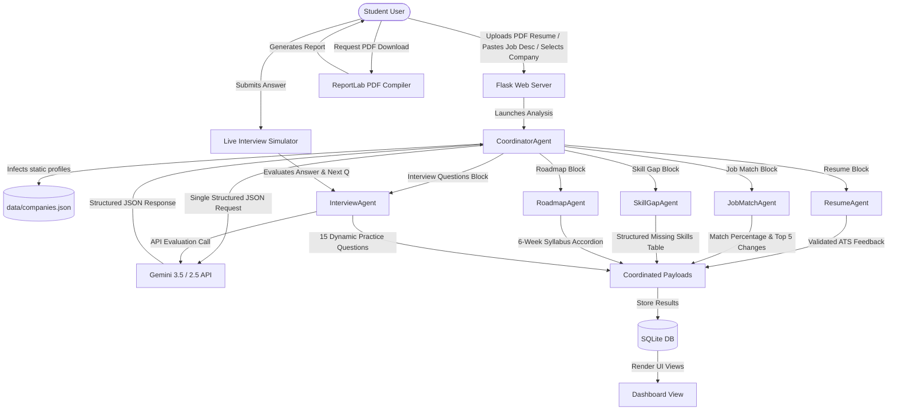

# AI Campus Placement Agent

An AI-powered multi-agent assistant that helps students prepare for campus placements through resume analysis, job matching, personalized learning roadmaps, skill gap analysis, and interactive mock interviews.

This is a production-quality application built for the **Kaggle AI Agents Intensive Course Capstone Project**.

---

## Why is this an AI Agent System (and NOT a Chatbot)?

A typical chatbot operates as a single-turn or multi-turn conversational loop, where a single large language model (LLM) responds directly to user queries. 

In contrast, the **AI Campus Placement Agent** implements a **Coordinated Multi-Agent Architecture**:
1. **Orchestrated Workflow**: A single, central `CoordinatorAgent` receives the initial workspace context (resume, target job description, target company profiles).
2. **Task Delegation**: The coordinator executes a single structured LLM call to save token costs and prevent rate-limiting, and then delegates the resulting data subsets to specialized sub-agents.
3. **Dedicated Domain Responsibilities**: Each specialized agent is modeled as an independent Python class focusing on a single task:
   * **ResumeAgent**: Evaluates ATS formatting, experiences, strengths, and suggests grammar improvements.
   * **JobMatchAgent**: Performs keyword extraction and evaluates match percentages against the target role.
   * **SkillGapAgent**: Maps missing skills into an actionable table showing learning times, importance, and priority.
   * **RoadmapAgent**: Generates a custom 6-week curriculum with topic deep-dives and estimated study hours.
   * **InterviewAgent**: Generates tailored interview questions and handles dynamic, real-time responses scoring technical accuracy and communication.

---

## System Architecture & Workflow



---

## Features

1. **Resume Analysis & ATS Scoring**: Extract text from PDF resumes, run grammar & style checks, identify weaknesses, and calculate a grounded ATS Score.
2. **Job Description Matching**: Paste a Job Description to compare candidate metrics against corporate requirements, listing the exact changes needed to pass initial screenings.
3. **Skill Gap Remediation Table**: Get a prioritizing list of missing skills detailing estimated learning times, resource links, and custom project suggestions.
4. **6-Week Study Roadmap**: Access a weekly preparation calendar mapping theoretical topics, coding challenges, and revision items.
5. **Interactive Mock Interview Simulator**: Engage in a live, conversational chat with the Interview Agent. Answers are evaluated dynamically on technical accuracy, communication style, and confidence indicators.
6. **Static Company Profiles**: Contains pre-cached interview processes, hiring guidelines, and preparation advice for major companies: Google, Microsoft, Amazon, TCS, Infosys, Accenture, Capgemini, and Wipro.
7. **Comprehensive PDF Reports**: Generates and compiles a formatted, multi-page PDF document summarizing placement analysis and roadmaps using ReportLab.

---

## Tech Stack

* **Frontend**: HTML5, CSS3, JavaScript, Bootstrap 5 (Material/Glassmorphism theme)
* **Backend**: Python, Flask, SQLite (for persistence of analyses & interview sessions)
* **AI Core**: Google Gen AI Python SDK (`google-genai`), Gemini API (Central model selection: `gemini-2.5-flash`)
* **Utilities**: PyPDF2 (PDF parsing), ReportLab (PDF compiling), python-dotenv (environment variables)

---

## Folder Structure

```
AI-Campus-Placement-Agent/
│   app.py                  # Flask Application Server
│   config.py               # Path configurations & Model settings
│   prompts.py              # Central prompt registry
│   requirements.txt        # Project dependencies
│   .env                    # Environment key file (GitIgnored)
│   README.md               # Project documentation
│
├───agents/                 # Independent AI Agent classes
│       coordinator.py
│       resume_agent.py
│       job_match_agent.py
│       skill_gap_agent.py
│       roadmap_agent.py
│       interview_agent.py
│
├───data/                   # Pre-cached static profile files
│       companies.json
│
├───static/                 # Styles and JS scripts
│   ├───css/
│   │       style.css
│   └───js/
│           script.js
│
├───templates/              # HTML layout templates
│       index.html
│       dashboard.html
│       interview.html
│
├───utils/                  # Backend support utilities
│       database.py
│       gemini.py
│       pdf_reader.py
│       report_generator.py
│
├───uploads/                # Uploaded resumes (Created on runtime)
└───reports/                # Generated report PDFs (Created on runtime)
```

---

## Installation & Setup

### 1. Clone the repository
```bash
git clone https://github.com/deepikagandla7456/ai-campus-placement-agent.git
cd ai-campus-placement-agent
```

### 2. Configure Environment Variables
Create a `.env` file in the root folder:
```env
FLASK_SECRET_KEY=placement_agent_secret_key_12345
GEMINI_API_KEY=YOUR_GEMINI_API_KEY_HERE
```
> **Note:** Generate your Gemini API Key from Google AI Studio.

### 3. Install Dependencies
Ensure you have Python 3.9+ installed, then run:
```bash
pip install -r requirements.txt
```

### 4. Start the Application
Launch the Flask development server:
```bash
python app.py
```
The application will be running at `http://127.0.0.1:5000/`. Open this link in your browser to start.

---

## Demonstration Guidelines (3–5 Minute Capstone Pitch)

1. **Slide 1: Problem & Multi-Agent Solution** (30s)
   * Explain the friction students experience when jumping between disconnected tools for resumes, ATS, calendars, and mock coding.
   * Introduce the Coordinated Multi-Agent concept.
2. **Action 1: Upload & Process** (45s)
   * Upload a sample resume PDF, select "Google" or "Amazon", paste a job description, and click "Analyze".
   * Draw attention to the **Agent Progress Panel** showing live steps as each agent finishes its delegated calculations.
3. **Action 2: Dashboard Deep Dive** (60s)
   * Show the visual gauges (ATS, Job Match).
   * Expand the strengths/weaknesses accordions.
   * Point out the skill gap priority matrix and the timeline roadmap.
4. **Action 3: Interactive Interview Simulator** (45s)
   * Start the mock interview. Type a response to the current question.
   * Show the immediate response evaluation (technical score, communication score, recommendations) rendering in the sidebar.
5. **Action 4: PDF Compilation** (30s)
   * Click "Download Report". Open the compiled ReportLab PDF to display structured, printable placement roadmaps.

---

## Future Scope

To extend the system beyond the capstone project, the following features are planned:
* **GitHub Profile Analyzer**: Scrape repositories to grade coding quality and contribution frequency.
* **LinkedIn Profile Review**: Sync profile sections to suggest bio keywords and networking adjustments.
* **Voice Mock Interviews**: Support voice-to-text and speech analysis to grade interview tone and pace.
* **Resume Version Comparison**: Compare formatting changes across iterations to track improvement.
* **LeetCode Progress Tracking**: Import solved problem counts and display targeted coding challenges.
* **Recruiter Email Generator**: Compose cold outreach emails tailored to hiring managers.
* **Placement Calendar Integration**: Log preparation milestones directly to Google Calendar.
* **Internship Recommendation Agent**: Suggest live job posts matching analyzed skill sets.

---

## License

This project is licensed under the MIT License - see the LICENSE file for details.
